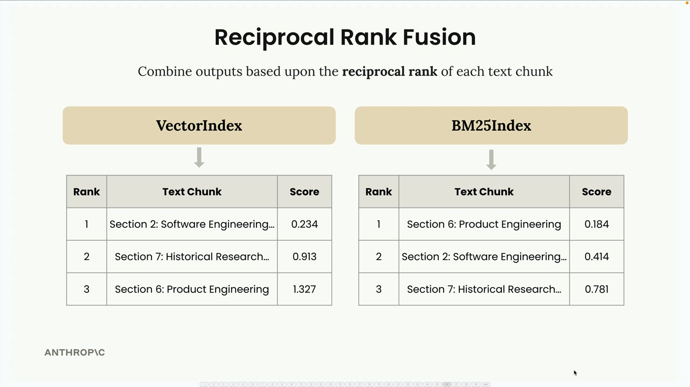
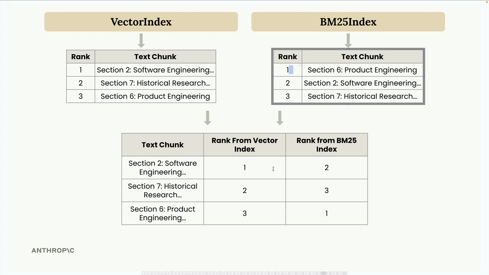
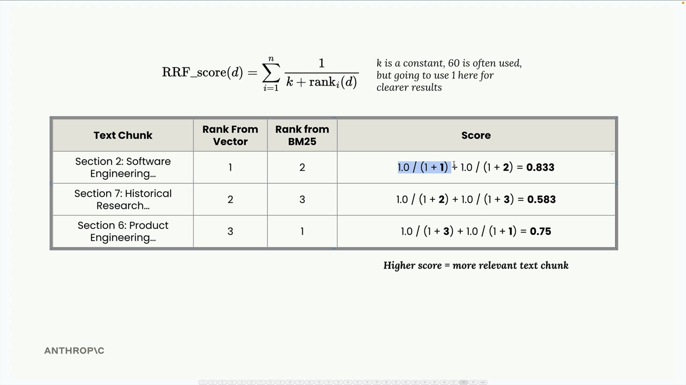
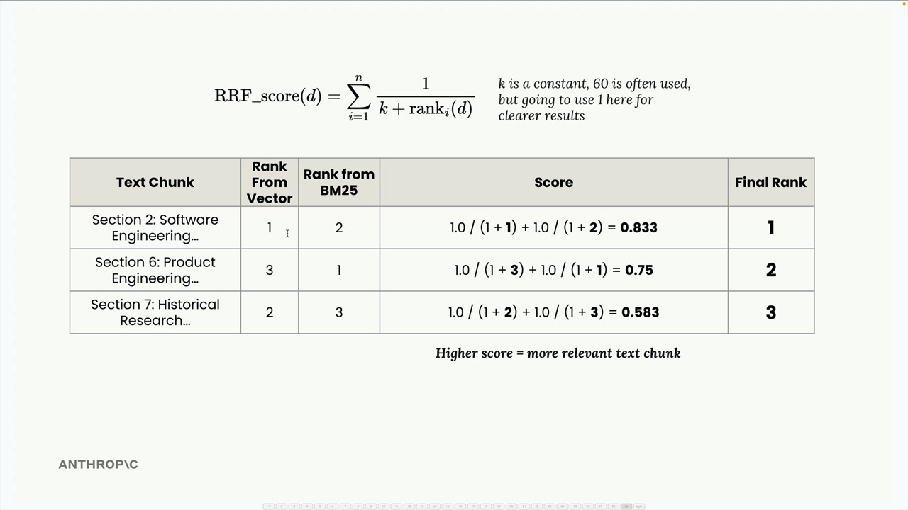

# Combining semantic and lexical search: `Retriever` and RRF

## Recap: why two search results need merging

`semantic-vs-lexical-search.md` (11d) covered why neither search method alone is enough:
semantic search (`VectorIndex`) can miss exact terms because it matches on meaning, not
literal tokens; lexical search (`BM25Index`) can miss conceptual matches because it only
understands term overlap, not meaning. Hybrid search runs both and merges their results — this
exercise is that merge step.

## The shape that makes combining them possible

`VectorIndex` and `BM25Index` already expose the same three methods: `addDocument`,
`addDocuments`, and `search(query, k)` returning `[[document, score], ...]`. `Retriever`
doesn't care _how_ either index scores relevance internally — only that both conform to this
shape. The lesson's Python formalizes this as a `Protocol` (structural typing: any object with
these three methods qualifies, no inheritance required). JS has no equivalent language
construct — it doesn't need one, since plain JS already works this way: as long as an object
has the right methods, it's usable, with no formal interface declaration at all.

## What `Retriever` does

- `constructor(...indexes)` — takes one or more search index instances (throws if given zero).
- `addDocument` / `addDocuments` — fan out to _every_ underlying index, so one call indexes the
  same chunk into both `BM25Index` and `VectorIndex` at once.
- `search(queryText, k, kRrf = 60)` — the actual merge, via **Reciprocal Rank Fusion (RRF)**.

## Understanding Reciprocal Rank Fusion

Merging results from two different search methods isn't as simple as concatenating two lists —
each method scores relevance on its own scale, and those scales aren't comparable to each
other. RRF sidesteps that instead of solving it: it throws away the scores entirely and works
with _rank position_ alone.

**1. Different methods, different score scales.** Searching `report.md` for
`"INC-2023-Q4-011"`, `VectorIndex` and `BM25Index` each return their own ranked list — and each
list's scores live on a completely different scale:



A vector distance of `0.234` and a BM25 score of `0.184` aren't measuring the same thing — one
is a cosine distance in embedding space, the other is a term-frequency-weighted score. There's
no principled way to average them directly, so trying to merge on the raw numbers is a dead
end.

**2. Convert scores to ranks.** Instead, reduce each index's results down to just _rank_ — a
chunk's position (1st, 2nd, 3rd, ...) within that index's own list — and combine both indexes'
ranks into one table per chunk:



Now every chunk has two ranks, one per index, on the same comparable 1st/2nd/3rd scale — no
matter how different the underlying scores were.

**3. Apply the RRF formula.** For each document `d`, sum `1 / (k + rank_i(d))` across every
index `i` it appeared in:

```
RRF_score(d) = Σ 1 / (k + rank_i(d))
```

`k` is a constant that controls how much a rank difference matters: a larger `k` flattens the
curve so rank 1 vs. rank 2 barely matters, a smaller `k` makes top ranks count for much more.
`60` is the standard value from the original RRF paper (and `index.js`'s `kRrf` default), but
the worked example below uses `k = 1` instead, purely to keep the arithmetic easy to follow:



- Section 2: `1.0/(1+1) + 1.0/(1+2)` = `0.833`
- Section 7: `1.0/(1+2) + 1.0/(1+3)` = `0.583`
- Section 6: `1.0/(1+3) + 1.0/(1+1)` = `0.75`

**4. Sort by combined score, descending.** Note the direction flips from what fed into it:
raw distances/BM25 scores are "lower is better", but the RRF score itself is "higher is better":



Section 2 wins — it placed 1st in one index and 2nd in the other, the best combination of the
three chunks. That matches intuition: a chunk both search methods roughly agree is good should
outrank one that only a single method liked.

## Why rank instead of score — a correction from 11d

11d's notes speculated that normalizing BM25's score to be "lower is better" (matching
`VectorIndex`'s cosine distance) was "what's needed to merge and re-rank both result sets
together." Having now seen the actual algorithm above, that's not quite right: **RRF never
looks at score values at all** — only where each document lands in its own list, per step 2.
A cosine distance of `0.03` and a raw BM25 score of `12.7` are never compared to each other
directly. The score-direction alignment from 11d isn't what makes this particular merge work —
it would matter for a naive "average the two scores" strategy, just not for RRF.

## Deduplicating by object identity

`retriever.addDocuments` fans the _same_ array of document objects out to every index, so the
same object reference ends up stored in both `BM25Index.documents` and `VectorIndex.documents`.
That means results from the two indexes can be deduplicated by object identity — this file uses
a JS `Map` keyed directly on the document object itself (reference equality), the direct
equivalent of the lesson's `id(doc)` dictionary key in Python.

## Real results

The walkthrough above uses hand-picked numbers and `k = 1` purely to make the arithmetic easy
to follow — it isn't `index.js` actually running. Here's what running the real code, with the
default `kRrf = 60`, on `report.md` actually produces.

Querying `"What happened with INC-2023-Q4-011?"` against the combined retriever (k=3):

1. **Section 2: Software Engineering** — RRF score `0.0325` (tied for first)
2. **Section 10: Cybersecurity Analysis** — RRF score `0.0325` (tied for first)
3. **Methodology** — RRF score `0.0310`, well behind

The tie isn't a coincidence — checking each index individually confirms the two engines
actually _disagree_ about the order: BM25 alone ranks Software Engineering #1 and Cybersecurity
#2 (more literal mentions of the ID and its resolution), while vector search alone ranks
Cybersecurity #1 and Software Engineering #2 (more conceptually "about" incident response).
Each section picks up one 1st-place and one 2nd-place finish across the two indexes, landing on
an identical combined score. That's a clean example of what hybrid search is for: both signals
agree these two sections matter, even when they disagree about which matters _slightly_ more —
and Methodology, which only weakly overlaps on common vocabulary, stays well behind both in the
fused ranking.
